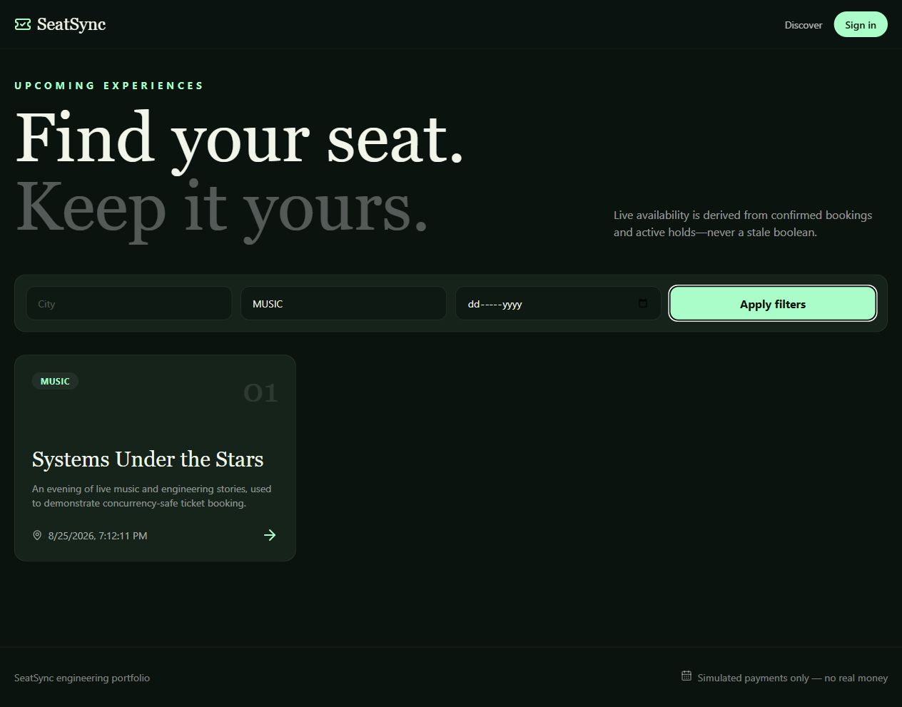
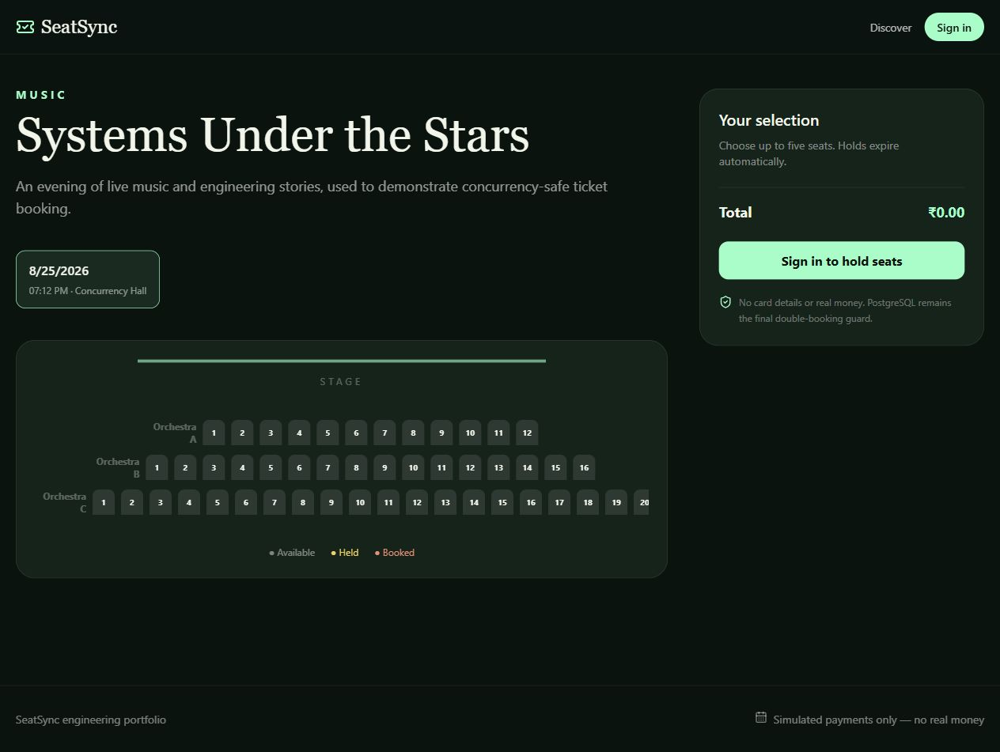

# SeatSync – Concurrent Event Ticket-Booking Platform

SeatSync is a portfolio-grade modular monolith built with FastAPI, PostgreSQL, Redis, Celery, React, and TypeScript. Its central invariant is simple: **at most one confirmed booking may own a seat for a show**, even under concurrent requests.

> Payment is simulated. SeatSync never collects card details and no real money is processed.

## Architecture

See [the architecture guide](docs/architecture.md), [ER diagram](docs/erd.md), and [API catalogue](docs/api.md). The backend is organized by business capability but deployed as one application. PostgreSQL is the system of record; Redis stores five-minute seat holds; Celery handles retried, idempotent notifications and CSV exports.

## Quick start

1. Copy `.env.example` to `.env`.
2. Run `docker compose up --build`.
3. Run `docker compose exec backend alembic upgrade head`.
4. Run `docker compose exec backend python -m app.database.seed`.
5. Open the UI at <http://localhost:5173>, Swagger at <http://localhost:8000/docs>, and MailHog at <http://localhost:8025>.

Demo accounts created by the seed command use password `SeatSync123!`:

- `admin@example.com` (ADMIN)
- `organizer@example.com` (ORGANIZER)
- `customer@example.com` (CUSTOMER)

## Why double booking occurs

A read-then-write implementation is unsafe: two requests can both read “available” before either writes a booking. An application-level check does not serialize independent processes, and a temporary cache is not a durable authority.

SeatSync uses two layers:

1. An atomic Redis Lua script checks all requested seat keys and creates the complete hold with a 300-second TTL. Competing customers cannot both hold the same seat.
2. Booking confirmation runs in one PostgreSQL transaction. A partial unique index on `(show_id, seat_id)` for confirmed booking-seat rows rejects a duplicate even if Redis is stale, delayed, or unavailable. All seats are inserted in the same transaction, so partial bookings roll back.

Availability is derived, never stored as a boolean: confirmed `booking_seats` produce `BOOKED`; live Redis keys produce `HELD`; all remaining venue seats are `AVAILABLE`.

## Booking transaction and idempotency

The confirmation endpoint validates ownership and expiry of the hold, validates that the show is active and in the future, calculates prices from `show_prices`, and records a `PENDING` booking plus a simulated payment attempt. A successful simulation inserts every confirmed booking-seat row, marks the booking `CONFIRMED`, stores the result against `(user_id, idempotency_key)`, commits, and removes the Redis hold. Failure or timeout records an `EXPIRED` booking and payment history and releases the hold.

Repeating the same idempotency key returns the stored status code and response body; it does not create a second booking or payment attempt.

## Payment simulation

Clients explicitly choose `SUCCESS`, `FAILURE`, or `TIMEOUT` in development. This makes failure paths deterministic and testable. Amounts use integer minor currency units (for example, paise or cents); floating-point money is never used. No real money is processed.

## Database design

All timestamps are timezone-aware UTC values. Historical bookings, booking-seat rows, payment attempts, refunds, audit events, and notifications are retained. Cancellation changes lifecycle states instead of deleting records. Foreign keys, check constraints, organizer ownership checks, a venue-seat uniqueness constraint, and the confirmed-seat partial unique index enforce invariants near the data.

Common discovery and dashboard paths are indexed: event category, venue city, show start/status, booking customer/status, booking organizer/show, payments, audit timestamps, and notification deduplication keys.

## Security decisions

- Passwords are Argon2-hashed and never returned.
- Short-lived access JWTs and rotating refresh-token identifiers are used; only refresh-token hashes are stored.
- Role checks protect organizer and administrator routes; resource ownership is checked in addition to role.
- JWT secrets and database credentials come from environment variables.
- Audit metadata excludes secrets, password hashes, JWTs, and payment credentials.
- Attendee exports are scoped to the organizer who owns the event.

## Development commands

```bash
docker compose up -d postgres redis mailhog
cd backend
python -m venv .venv
pip install -e ".[dev]"
alembic upgrade head
pytest
ruff check .
```

```bash
cd frontend
npm install
npm run dev
npm run test
npm run build
```

## Testing

The suite covers authentication and RBAC, seat generation, overlapping shows, discovery, hold expiry and ownership, all-or-nothing conflicts, idempotency, all payment outcomes, lifecycle rules, notification retry deduplication, and organizer data isolation.

The mandatory concurrency test is `backend/tests/integration/test_concurrency.py`. It launches 50 customers against one seat, emits a JSON report with successful/rejected/failed counts, and asserts exactly one winner and no duplicate confirmed row. Run it against the Compose PostgreSQL and Redis services:

```bash
pytest -m integration backend/tests/integration/test_concurrency.py -s
```

The checked-in generated report records the executed local result: both the Redis hold race and the stale-Redis PostgreSQL confirmation race produced **1 successful, 49 rejected, and 0 failed** attempts; the database contained exactly **1** confirmed booking-seat row. See `backend/tests/integration/concurrency-report.json`. These are correctness counts from the test, not performance claims.

For HTTP load testing:

```bash
locust -f backend/load_tests/locustfile.py --host http://localhost:8000
```

No performance figures are claimed in this repository. Generate results in your own environment by executing the included tests.

## Known limitations

- Payment outcomes are deterministic simulations, not provider webhooks.
- Holds disappear if Redis loses non-persisted data; PostgreSQL still prevents double booking.
- A single default currency is used per show and taxes/fees are intentionally omitted.
- Cancellation eligibility uses a configurable time window and has no ticket-transfer workflow.
- Email is delivered to MailHog or the console in development.
- The modular monolith is designed for one deployment unit; horizontal scaling requires shared PostgreSQL and Redis, which Compose already models.

## Repository map

- `backend/app`: modular FastAPI application and Celery jobs
- `backend/migrations`: Alembic schema history
- `backend/tests`: unit and integration tests
- `backend/load_tests`: Locust concurrency scenario
- `frontend/src`: customer and organizer React interfaces
- `docs`: architecture, ERD, API, and demo evidence
- `postman`: importable API collection

## Demo screenshots




