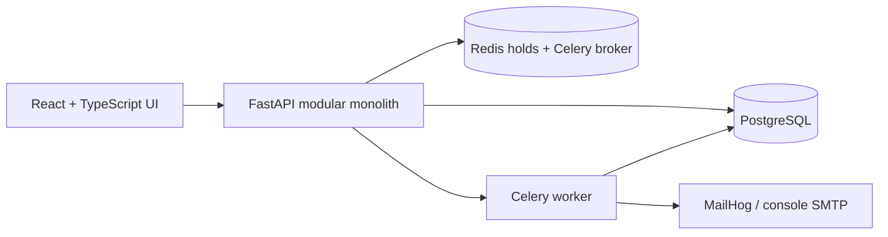
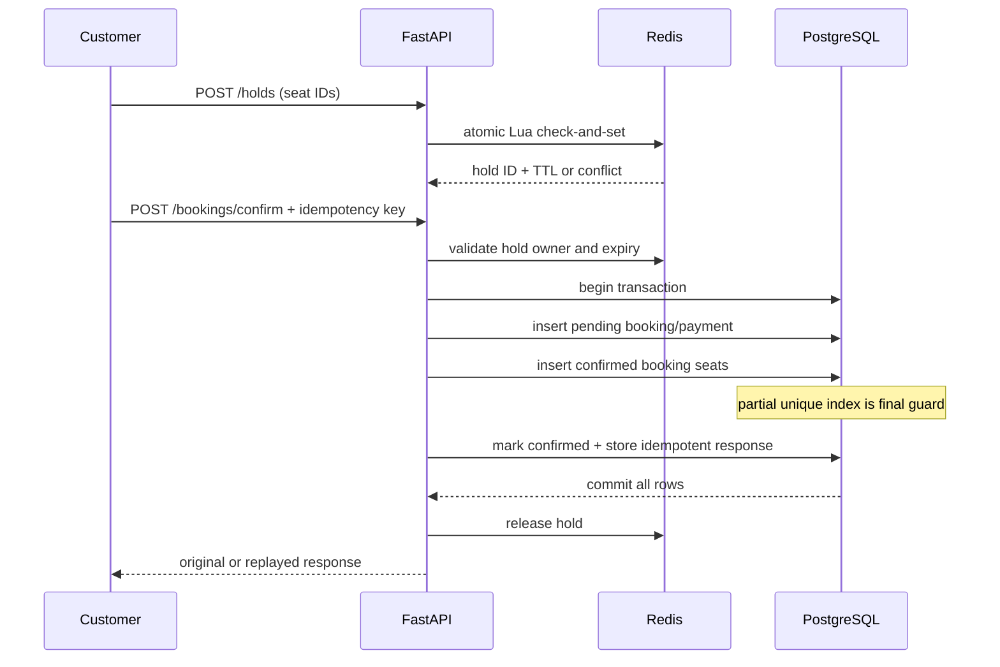

# Architecture plan

SeatSync is a modular monolith: modules own route, service, and schema code, while sharing one process and one PostgreSQL database. This keeps deployment and debugging appropriate for a small team while preserving boundaries that can be extracted only if scale later justifies it.

## Module responsibilities

| Module | Responsibility |
|---|---|
| auth/users | registration, password verification, JWTs, roles |
| venues | organizer-owned venues, layout validation, seat generation |
| events/shows | catalogue, show scheduling, prices, discovery |
| seat_holds | atomic Redis holds and derived availability |
| bookings/payments | transaction, uniqueness, idempotency, lifecycle |
| notifications | transactional notification records and retried delivery |
| audit | append-only security/business history |
| reporting | organizer metrics and asynchronous attendee CSV |

## Concurrency sequence

## Failure handling

- Redis conflict: reject before payment simulation.
- Redis outage: new holds fail closed; the database constraint still protects confirmations already in flight.
- Partial conflict: one transaction rolls back every selected seat.
- Payment failure/timeout: retain the attempt, expire the booking, release the hold.
- Notification failure: Celery retries the same notification row; `deduplication_key` and `sent_at` prevent duplicates.

