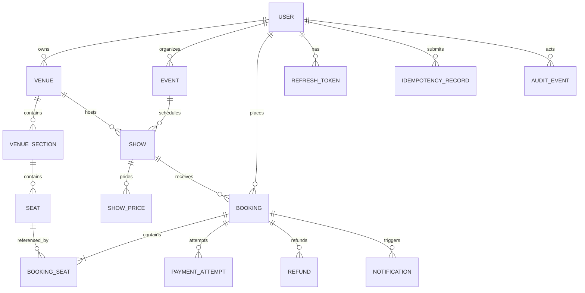

# Entity relationship diagram

The important constraints are `(venue_id, identifier)` on seats, `(show_id, category)` on prices, `(user_id, key)` on idempotency records, and a PostgreSQL partial unique index on `(show_id, seat_id)` where a booking-seat row is `CONFIRMED`.

